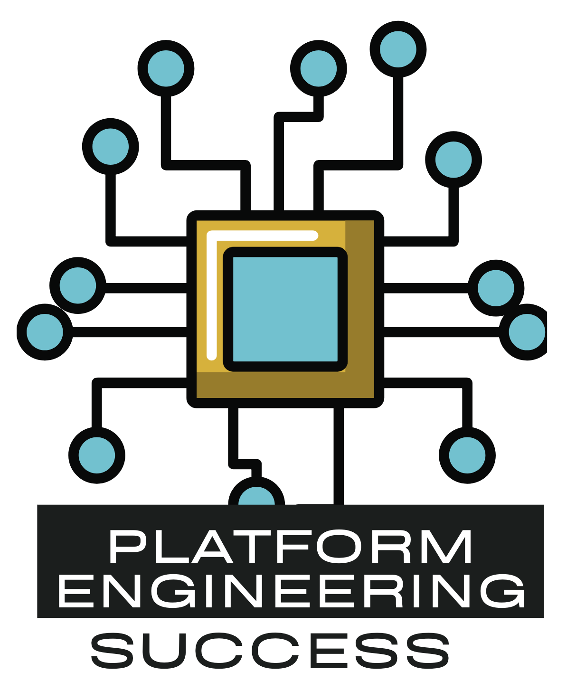

Most enterprises are seeing the emergence of a team called `Platform Engineering`. This team has been a natural evolution of the devops team. This team saw enough of a business case to solve common challenges that each of the engineering teams have to deal with like building a secure platform for deployment of services, integration with the enterprise tooling for logging, monitoring and observability. These are problems that the each of the engineering teams otherwise tend to solve for themselves. 

With that said - these teams often seen the various engineering teams reach out and adopt these platforms. This ebook is an attempt to speak some of the experiences I have seen and dealt with first hand in such enterprises. This also covers some of the strategies that we adopted as a team to help accelerate the adoption but also make it a more inclusive platform.

Feedback is always welcome welcome, please suggest edits, changes or collab requests via PR - credits will be added to the credits section as well.

  * Preface
  * What is your purpose 
  * Understanding your landscape
  * Knowing your stakeholders
  * How do you measure value?
  * Building for an open eco-system
  * Running it like a business unit
  * Wider impact across the organisation